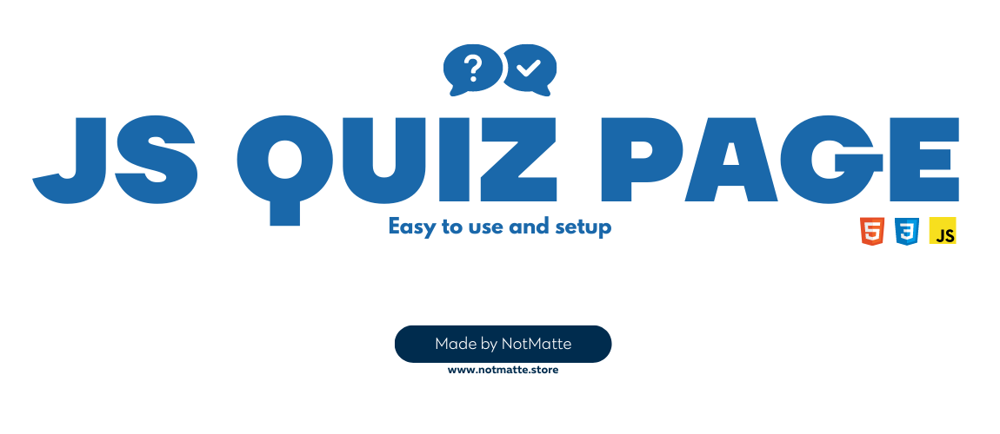

<div align="center">
  <a href="https://ds.notmatte.store/">
    
  </a>
</div>


## About The Project

[Need support?](https://ds.notmatte.store/)

With this web page we built a simple quiz system using points that allows you to add various pages solely from `script.js`, <br>and this page was styled by me, if you are looking for qualified people in UX Design feel free to contact me via discord (NotMatt#3455).


### What did I use to create this page?

* [HTML]
* [CSS]
* [JS]


<div align="center">
  
</div>


## How can I create my quiz?

To create your quiz just add a JSON element to the constant `quizData` using the format as per example: <br>
(The file name is script.js and the quizData variable is located on line 1).

### JSON quizData example

```sh
{
        question: "In quale città italiana si trova “Piazza di Spagna”?", /* Question */
        a: "Milano", /* Answer A */
        b: "Bologna", /* Answer B */
        c: "Roma", /* Answer C */
        d: "Venezia", /* Answer D */
        correct: "c", /* Correct answer */
    },
```

The quizzes will automatically load from the JSON and will be displayed one after another on the main page <br>and then conclude with the page that establishes how many points you have scored.


<div align="center">
  <a href="https://ds.notmatte.store/">
    
  </a>
</div>
